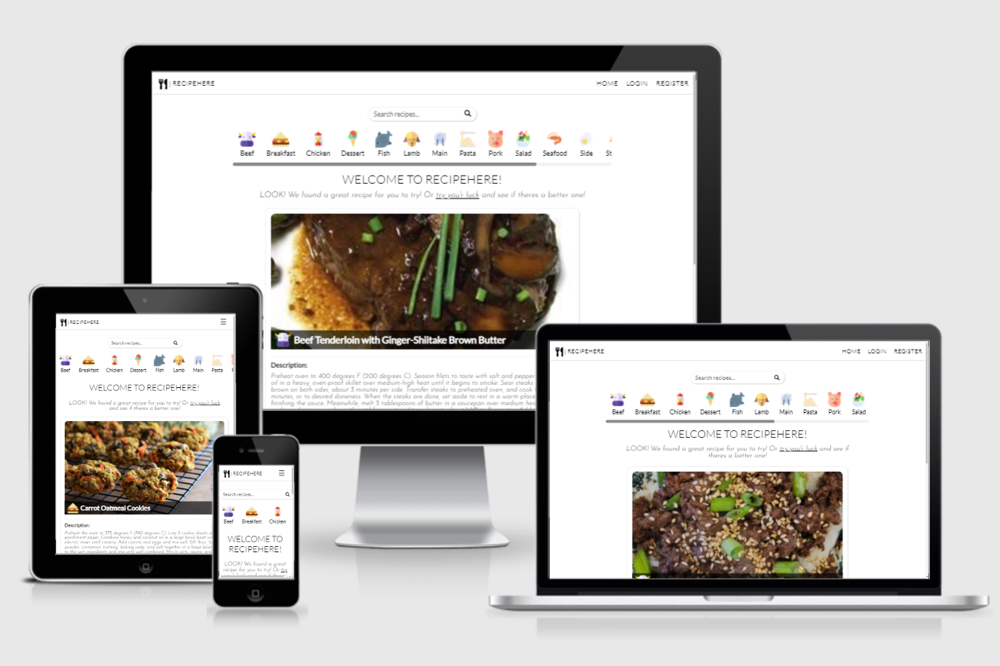

# RECIPEHERE Web App

### Github Repository: [https://github.com/pjotrs-osnovskis/recipe-app-ms3-po](https://github.com/pjotrs-osnovskis/recipe-app-ms3-po)

### Deployed Project (Heroku): [https://recipe-app-ms3-po.herokuapp.com/](https://recipe-app-ms3-po.herokuapp.com)


---
## **Idea/Description**
<br>

I took idea from the list that was offered by Code Institute. It's a recipe application where users can create own accounts, log in and out from their accounts, view, search recipes. In addition, when user is logged in, they have own profile page where they can view, create, edit and delete own recipes. On landing page, there is a scrollable category list for users convenience, so they can browse recipes in their desired categories. Also there is a search option, that looks in to recipe name, description, ingredients and category to show best possible matches to users enquiry. Also recipe information is grouped in to cards or blocks, where user can see a picture, recipe name, description, ingredients list, additional information about cooking times and how many servings is current recipe for. When logged in, user can create or edit recipes using form that has input fields according to recipe view description mentioned above. Every recipe had a unique id, so can be shared between users easily by using a link from URL field in their browser.

<br>




---
## **Potential Website users**
<br>

This web application was created for users to find, create and share recipes, find new ideas to improve their cooking skills or surprise their loved ones with something new and exciting.


---
## **Owners goals**
<br>

Application would be owned by the owner and used to attract new users with its simplicity. Potentially adding advertisement or product placement.

---
## **User Stories**
<br>

1. As a new visitor, I want to:
    * understand what this website is used for;
    * navigate easily and intuitively;
    * have all questions answered before I have any;
2. As a potential user, I want to:
    * find recipes easily using search or categories options;
    * understand how to login or register;
    * understand how to create a new recipe or update a new one;
3. As a returning user, I want to:
    * login to own account quickly and easy;
    * create or update own recipes using convenient forms;
    * find recipes I am interested in;


---
## **5 UX Planes**
<br>

* ### **Strategy Plane**
Web application was created for users to be able to find, create and share recipes easily. In table below you can see what this web app should contain for users value, Some ideas might not be included due to time limits for this project.

| Opportunity   | Importance    | Viability/Feasibility |
| ------------- |:-------------:| :-----:|
| Services offered | 5 | 5 |
| Search | 5 | 5 |
| Categories | 4 | 3 |
| Authentication | 4 | 4 |
| Create/Edit | 4 | 4 |
| Recipe Image | 3 | 2 |
| Recipe Video [^1] | 3 | 1 |
| Recipe Rating/comments [^2] | 4 | 3 |

> Ideas marked with a footnote are some of the potential ones that could be implemented if there would be more time for the project.

[^1]: I thought to implement it, but since it is a MongoDB server-less project, you have to upload video to services like YouTube and share a link, same as with pictures. Not sure if it is very convenient for users.

[^2]: Recipe rating, If I will have enough time I will add this to the project, it would be convenient to have reviews and rating for others to see how good it is.


* ### **Scope Plane**
Features that this project should include:
    * All pages must include navigation, search and footer;
    * Landing page with categories and random recipe
    * Login and register page with relevant forms
    * Profile (My Recipes) page with list of users recipes and edit and delete options
    * Create/Edit recipe with relevant forms


* ### **Structure Plane**
All pages have navigation, search, main block and a footer.
Main block content:
- **Landing page** has categories vertical and scrollable list, and a random recipe to bring user an idea to cook something random;
- **Search** page will show a list of recipes containing keywords, if no results it will show a message;
- **Login/Register** pages with relevant forms, register page has password comparison;
- **Profile** page, called "My Recipes" in navigation, shows users recipes with edit/delete options;

Some ideas still remain, but were not implemented due to time frame just yet.

* ### **Skeleton Plane**

Web application is responsive, so it is convenient to use across different devices.

**Wireframes**:
 Page | Desktop | Mobile |
| :--- | :--: | :--: |
| Home | [View](static/img/readme-img/wireframes/wf-home-dsktp.png) | [View](static/img/readme-img/wireframes/wf-home-mob.png) |
| Search | [View](static/img/readme-img/wireframes/wf-search-dsktp.png) | [View](static/img/readme-img/wireframes/wf-search-mob.png) |
| Login | [View](static/img/readme-img/wireframes/wf-login-dsktp.png) | [View](static/img/readme-img/wireframes/wf-login-mob.png) |
| Register | [View](static/img/readme-img/wireframes/wf-register-dsktp.png) | [View](static/img/readme-img/wireframes/wf-register-mob.png) |
| Profile | [View](static/img/readme-img/wireframes/wf-profile-dsktp.png) | [View](static/img/readme-img/wireframes/wf-profile-mob.png) |
| Create/Edit | [View](static/img/readme-img/wireframes/wf-create-dsktp.png) | [View](static/img/readme-img/wireframes/wf-create-mob.png) |
| Recipe Card | [View](static/img/readme-img/wireframes/wf-recipe-card-dsktp.png) | [View](static/img/readme-img/wireframes/wf-recipe-card-mob.png) |


* ### **Surface Plane**


**Colors:**

I decided to keep website simple and did not use any colours apart from CRUD buttons. Simple red, green and dark orange with a little transparency to make it less bright.

**Fonts:**

* Lato - Used mainly across whole website
* Josefin - Used for paragraphs

**Navigation/Forms:**

No CSS frameworks used, created everything my own with some code snippets and ideas credited in comments.


---
 ## **Features**
<br>

**Implemented:**

* Web app contains 8 pages, that has a navigation, search and footer on all of them and unique block content templates:
    * Home - categories vertical list and random recipe
    * Search - has search results ot if none found - a message
    * Login - login form
    * Register - register form
    * Profile - list of own recipes
    * Create recipe - relevant form with recipe name, description, image URL, etc
    * Edit recipe - form same as create recipe, but takes unique id of a recipe that needs editing and pulls out relevant data inside of input fields
    * 404 - in case of "not found" error it contains relevant message and home link
* Created using HTML, CSS, JS, jQuery, Python, Flask, EmailJS and Google Fonts.
* Users can register, login, logout, view, create, edit and delete recipes.

**Potential features:**

* Recipe rating and comments
* Recipe videos
* Social media interactions, like "Share recipe on Facebook"
* Add ingredients to shopping list

---
## **Technologies Used**
<br>

|Technology|Reason|
| :-- | :-- |
| [HTML](https://www.w3schools.com/html/) | Markup |
| [CSS](https://www.w3schools.com/css/) | Styling |
| [JavaScript](https://www.w3schools.com/js/) | Interactive Frontend |
| [jQuery 3.6](https://jquery.com/) | DOM manipulation in some cases |
| [Python](https://www.python.org/) | Backend |
| [Flask](https://palletsprojects.com/p/flask/) | Backend framework |
| [EmailJS](https://www.emailjs.com/)  | Contact Us functionality |


---
## **Resources**
<br>

### **Resources used**
* Code Institute Course Material
* Code Institute's Slack Community
* [W3Schools](https://www.w3schools.com/) - Minor CSS and JavaScript code ideas
* [Stack Overflow](https://stackoverflow.com/) - Problem resolution, credited in the code
* [jQuery](https://learn.jquery.com/using-jquery-core/) - jQuery documentation
* [Flask](https://flask.palletsprojects.com/en/2.0.x/) - Flask documentation
* [EmailJS](https://www.emailjs.com/) - EmailJS documentation


### **Tools Used**
* [Git](https://git-scm.com/book/en/v2/Getting-Started-About-Version-Control) - Local Repository/Version Control
* [GitHub](https://github.com/) - Remote repository and deployment
* [VSCode](https://code.visualstudio.com/) - IDE
* [HTML Validator](https://validator.w3.org/) - HTML Validation
* [CSS Validator](https://jigsaw.w3.org/css-validator/) - CSS Validation
* [JS Validator](https://jshint.com/) - JS Validation
* [PEP8 Validator](https://jigsaw.w3.org/css-validator/) - Python Validation
* [Am I Responsive](http://ami.responsivedesign.is/) - Responsive Webpage Presentation
* [Balsamiq](https://balsamiq.com/wireframes/) - Creating wireframes
* [MS Paint](https://support.microsoft.com/en-us/windows/get-microsoft-paint-a6b9578c-ed1c-5b09-0699-4ed8115f9aa9) - Cutting out wireframes and screenshots
* [PowerMapper](https://www.powermapper.com/) - Browser compatibility checks
* [removebg](https://www.remove.bg/) - Remove category image background

---
## **Testing**
<br>

### **Pre-testing**
During the development of this project I used Chrome Dev Tools to test and check for responsiveness across various devices. To double check I used Heroku deployed project on Android Chrome on my phone, what helped a lot as discovered few positioning errors that were fixed.

### **Main Testing**

* **HTML** - as this is an Flask application, HTML validator won't pick up Flask template references and shows up errors due to that reason as well as *lang* warnings. Apart from that here are some errors found while validating the code:

    * **add_recipe.html** - invalid attribute for text area "type", had duplicate ID, unnecessary name attribute - fixed. Unfixed errors are connected with `value="¾"`, I tried to use html code like `&frac34;` for it, but it won't work with MongoDB.

    * **base.html** - missing heading for search field. There is no need for one.

    * **contact_us.html** - was missing a closing div tag - fixed.

    * **edit_recipe.html** - as it's base was coped from add_recipe.html, I had same errors, that were fixed.

    * **home.html** - categories list section lacks heading, in my opinion it is not necessary, as section is very clear.

    * **login.html** - no heading in flash messages section, there is no need for it.

    * **profile.html** - no errors found

    * **register.html** - no heading in flash messages section, there is no need for it.

    * **search_results.html** - no errors found.


* **CSS** - no errors found

* **JS** - due to some jQuery used for overall author convenience, JS validator shows `$` as an undefined variable. Gives warning about template literal not being available in ES6, but no ES6 was used. Shows `mobileNav`, `goBack` and `remove` as unused variables, altho they are functions and are used in DOM to trigger them.

* **Python** - Errors found on PEP8 validator that were fixed and now shows `"All right"`:
```
W291:4:35:trailing whitespace
E501:38:80:line too long (89 > 79 characters)
E501:48:80:line too long (97 > 79 characters)
W293:49:1:blank line contains whitespace
E501:50:80:line too long (82 > 79 characters)
E201:72:29:whitespace after '('
E202:72:49:whitespace before ')'
E201:85:29:whitespace after '('
E501:90:80:line too long (84 > 79 characters)
E201:95:29:whitespace after '('
E202:95:74:whitespace before ')'
E125:111:5:continuation line with same indent as next logical line
W293:151:1:blank line contains whitespace
E501:204:80:line too long (93 > 79 characters)
E501:255:80:line too long (109 > 79 characters)
E303:273:1:too many blank lines (4)
E302:274:1:expected 2 blank lines, found 4
E231:299:43:missing whitespace after ':'
E501:302:80:line too long (80 > 79 characters)
W292:317:24:no newline at end of file
```

### **Lighthouse Reports**

> Lighthouse testing done on [**deployed project**](https://recipe-app-ms3-po.herokuapp.com/).

<br>

* [Home Page](https://recipe-app-ms3-po.herokuapp.com)

| Test | Mobile | Desktop |
| :-- | :--: | :--: |
| Performance     | 91 | 91 |
| Accessibility   | 100 | 100 |
| Best Practices  | 93 | 100 |
| SEO             | 100 | 100 |

* [Login](https://recipe-app-ms3-po.herokuapp.com/login)

| Test | Mobile | Desktop |
| :-- | :--: | :--: |
| Performance     | 94 | 97 |
| Accessibility   | 100 | 100 |
| Best Practices  | 100 | 100 |
| SEO             | 100 | 100 |

* [Register](http://recipe-app-ms3-po.herokuapp.com/register)

| Test | Mobile | Desktop |
| :-- | :--: | :--: |
| Performance     | 98 | 100 |
| Accessibility   | 90 | 90 |
| Best Practices  | 93 | 93 |
| SEO             | 100 | 100 |

**Accessibility** - Missed out label and input connection - fixed. 

| Test | Mobile | Desktop |
| :-- | :--: | :--: |
| Performance     | 98 | 100 |
| Accessibility   | 100 | 100 |
| Best Practices  | 93 | 93 |
| SEO             | 100 | 100 |

* [Profile (pete1)](http://recipe-app-ms3-po.herokuapp.com/profile/pete1)

| Test | Mobile | Desktop |
| :-- | :--: | :--: |
| Performance     | 78 | 97 |
| Accessibility   | 97 | 97 |
| Best Practices  | 93 | 93 |
| SEO             | 100 | 100 |

**Performance (Mobile)** - Category images too large, fixed.


deployment
check icons
admin can crud all recipes
change to false
