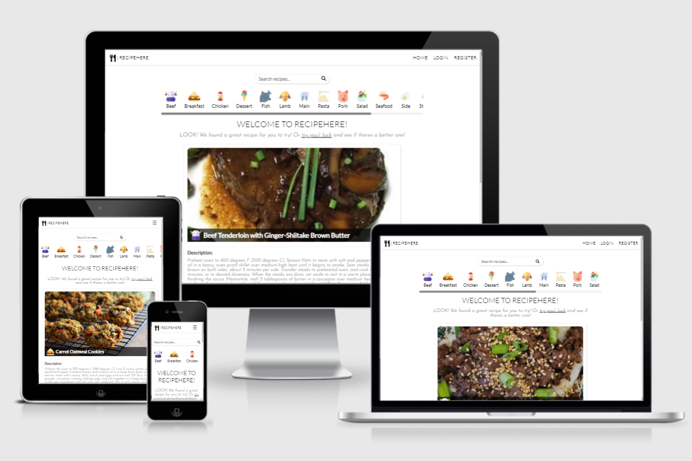

# RECIPEHERE Web App

### Github Repository: [https://github.com/pjotrs-osnovskis/recipe-app-ms3-po](https://github.com/pjotrs-osnovskis/recipe-app-ms3-po)

### Deployed Project (Heroku): [https://recipe-app-ms3-po.herokuapp.com/](https://recipe-app-ms3-po.herokuapp.com)

---
## **Idea/Description**
 

I took idea from the list that was offered by Code Institute. It's a recipe application where users can create own accounts, log in and out from their accounts, view, search recipes. In addition, when user is logged in, they have own profile page where they can view, create, edit and delete own recipes. On landing page, there is a scrollable category list for users convenience, so they can browse recipes in their desired categories. Also there is a search option, that looks in to recipe name, description, ingredients and category to show best possible matches to users enquiry. Also recipe information is grouped in to cards or blocks, where user can see a picture, recipe name, description, ingredients list, additional information about cooking times and how many servings is current recipe for. When logged in, user can create or edit recipes using form that has input fields according to recipe view description mentioned above. Every recipe had a unique id, so can be shared between users easily by using a link from URL field in their browser.

 

---
## **Potential Website users**
 

This web application was created for users to find, create and share recipes, find new ideas to improve their cooking skills or surprise their loved ones with something new and exciting.

---
## **Owners goals**
 

Application would be owned by the owner and used to attract new users with its simplicity. Potentially adding advertisement or product placement.

---
## **User Stories**
 

1. As a new visitor, I want to:
    * understand what this website is used for;
    * navigate easily and intuitively;
    * have all questions answered before I have any;
2. As a potential user, I want to:
    * find recipes easily using search or categories options;
    * understand how to login or register;
    * understand how to create a new recipe or update a new one;
3. As a returning user, I want to:
    * login to own account quickly and easy;
    * create or update own recipes using convenient forms;
    * find recipes I am interested in;

---
## **5 UX Planes**
 

* ### **Strategy Plane**
Web application was created for users to be able to find, create and share recipes easily. In table below you can see what this web app should contain for users value, Some ideas might not be included due to time limits for this project.

| Opportunity   | Importance    | Viability/Feasibility |
| ------------- |:-------------:| :-----:|
| Services offered | 5 | 5 |
| Search | 5 | 5 |
| Categories | 4 | 3 |
| Authentication | 4 | 4 |
| Create/Edit | 4 | 4 |
| Recipe Image | 3 | 2 |
| Recipe Video [^1] | 3 | 1 |
| Recipe Rating/comments [^2] | 4 | 3 |

> Ideas marked with a footnote are some of the potential ones that could be implemented if there would be more time for the project.

[^1]: I thought to implement it, but since it is a MongoDB server-less project, you have to upload video to services like YouTube and share a link, same as with pictures. Not sure if it is very convenient for users.

[^2]: Recipe rating, If I will have enough time I will add this to the project, it would be convenient to have reviews and rating for others to see how good it is.

* ### **Scope Plane**
Features that this project should include:
    * All pages must include navigation, search and footer;
    * Landing page with categories and random recipe
    * Login and register page with relevant forms
    * Profile (My Recipes) page with list of users recipes and edit and delete options
    * Create/Edit recipe with relevant forms

* ### **Structure Plane**
All pages have navigation, search, main block and a footer.
Main block content:
- **Landing page** has categories vertical and scrollable list, and a random recipe to bring user an idea to cook something random;
- **Search** page will show a list of recipes containing keywords, if no results it will show a message;
- **Login/Register** pages with relevant forms, register page has password comparison;
- **Profile** page, called "My Recipes" in navigation, shows users recipes with edit/delete options;

Some ideas still remain, but were not implemented due to time frame just yet.

* ### **Skeleton Plane**

Web application is responsive, so it is convenient to use across different devices.

**Wireframes**:
 Page | Desktop | Mobile |
| :--- | :--: | :--: |
| Home | [View](static/img/wireframes/wf-home-dsktp.png) | [View](static/img/wireframes/wf-home-mob.png) |
| Search | [View](static/img/wireframes/wf-search-dsktp.png) | [View](static/img/wireframes/wf-search-mob.png) |
| Login | [View](static/img/wireframes/wf-login-dsktp.png) | [View](static/img/wireframes/wf-login-mob.png) |
| Register | [View](static/img/wireframes/wf-register-dsktp.png) | [View](static/img/wireframes/wf-register-mob.png) |
| Profile | [View](static/img/wireframes/wf-profile-dsktp.png) | [View](static/img/wireframes/wf-profile-mob.png) |
| Create/Edit | [View](static/img/wireframes/wf-create-dsktp.png) | [View](static/img/wireframes/wf-create-mob.png) |
| Recipe Card | [View](static/img/wireframes/wf-recipe-card-dsktp.png) | [View](static/img/wireframes/wf-recipe-card-mob.png) |

---
* ### **Surface Plane**
 

**Colors:**

I decided to keep website simple and did not use any colours apart from CRUD buttons. Simple red, gree and dark orange with a little transparency to make it less bright.

**Fonts:**

* Lato - Used mainly across whole website
* Josefin - Used for paragraphs

**Navigation/Forms:**

No CSS frameworks used, created everything my own with some code snippets and ideas credited in comments.

---
* ### **Features**
 

**Implemented:**

* Web app has 

